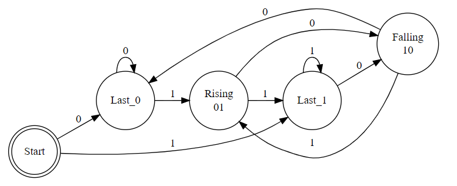
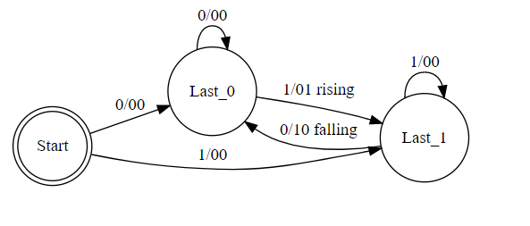

# Laboratorio 27 Novembre - FSM

## Testo
Creare un rilevatore di fronti positivi e negativi tramite una macchina a stati finiti di tipo Moore. Prima di iniziare con la scrittura di codice VHDL impostare uno schema a grafi identificando tutti gli
stati e le varie condizioni particolari. Considerare il segnale in
ingresso sincrono al clock che pilota tutta la macchina.

## Soluzione proposta

### Tabella delle transizioni

| Input | State  | Next state | Falling | Rising |
|:------|:-------|:-----------|:--------|:-------|
| 0     | Start  | Last_0     | 0       | 0      |
| 1     | Start  | Last_1     | 0       | 0      |
| 0     | Last_0 | Last_0     | 0       | 0      |
| 1     | Last_0 | Last_1     | 0       | 1      |
| 0     | Last_1 | Last_0     | 1       | 0      |
| 1     | Last_1 | Last_1     | 0       | 0      |

#### Macchina di Moore

#### Macchina di Mealy

#### Codifica degli stati
| Stato   | Codifica int |
|:--------|:-------------|
| Start   | 0            |
| Last_0  | 1            |
| Last_1  | 2            |
| Rising  | 3            |
| Falling | 4            |
